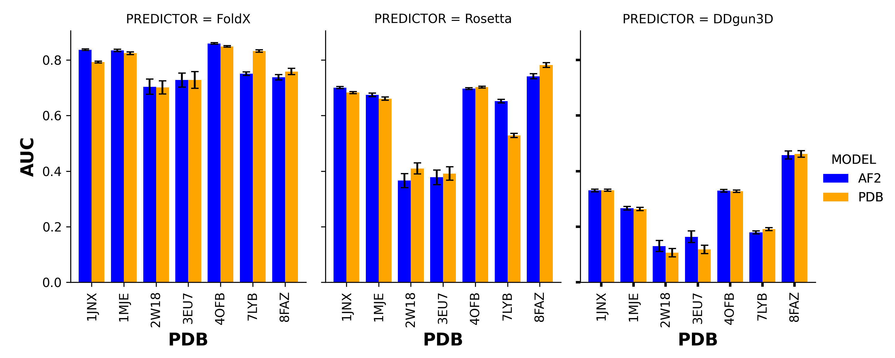

# CarePred: Classification of functional activity from Missense mutations in Tumor Suppresor breast cancer genes (BRCA1, BRCA2, PALB2 and RAD51C)

## 1. INTRODUCTION
This repo contains the code used to determine the impact of Generative AI protein stability predictor tools, more specifically AlphaFold2 (AF2) in the prediction of protein stability, analyzed by tools FoldX, Rosetta and DDGun3D. We evaluated the impact of protein stability to function using AF2 structures and compared it to the predictions of traditional in silico missense models. We find that prediction of Gibbs free energy (ΔΔG) from AlphaFold2 (AF2) structures analyzed with FoldX predicts LOF better than experimental-derived wild type structures in the BRCT domain of BRCA1 and the DNA binding domain (DBD) of BRCA2, but not in PALB2 and RAD51C. We also find that AF2 structures in the BRCT domain of BRCA1 and DBD-Dss1 domain of BRCA2 analyzed with FoldX measure homologous DNA recombination (HDR) activity significantly better than Rosetta and DDGun3D. Our study also revealed that there are other factors that contribute to predicting loss of function activity other than protein stability, with AlphaMissense ranking the best overall predictor of LOF activity in these tumor suppressor breast cancer genes

## 2. PUBLICATION

Generative AI impact on protein stability prediction in breast cancer genes \
Rohan Gnanaolivu, Steven Hart \
bioRxiv 2024.06.03.597089; doi: https://doi.org/10.1101/2024.06.03.597089

## 3. PREPROCESSING

Data used: dbNSFP 4.7 (https://dbnsfp.s3.amazonaws.com/dbNSFP4.7a.zip) \
Function data: Data folder

### ESMFOLD structures: src/code/create_esmfold.py \
python script used to create ESMFold structures

### AlphaFold2 mutimer structures were created using ColabFold v1.5.5

### FoldX 5.0 was installed from (https://foldxsuite.crg.eu/products#foldx) and pyFoldX was used with the script in src/code/run_foldx.py to create stability prediction

### Rosetta prediction were created using the script in src/code/rosetta_ddg.py

### DDGun3d prediction were created using the script in src/code/run_ddgun3d.py

## 4. ANALYSIS

** Experiment_zero.ipynb

This notebook contains code that compared the RMSD  from structures predicted by AF2 and ESMFOLD

** Experiment_one.ipynb

This notebook contains code that computes the rho between the protein stability derived from AF2 structures and experimentlly-derived structures analyzed by FoldX, Rosetta and DDGun3D. This notebook also contains the code for the rho calculation between protein stability derived from AF2 structures and HDR functional scores in genes BRCA1, BRCA2, PALB2 and RAD51C

** Experiment_two_analysis.ipynb

This notebook contains the code that compares the stability predictors to predict functional classification from AF2 structures and experimentally-derived strucutres. The notebooks also contains code that shows AlphaMissense and MetaRNN are the top predictor to predict function in BRCA1, BRCA2, PALB2 and RAD51C. It also shows stability computed from AF2 structures analyzed with FoldX ranks higher than experimentally-derived structures analyzed with FoldX

